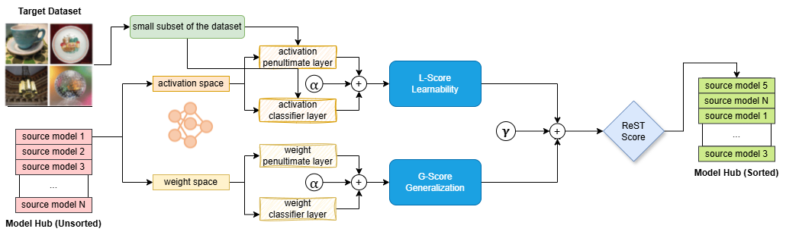

# REST: Remarkably Simple Transferability Estimation


## Overview
**REST (Remarkably Simple Transferability Estimation)** is a lightweight yet effective method for estimating the transferability of pre-trained models.  
It combines **weight-space generalization (G-score)** and **activation-space learnability (L-score)** with two interpretable hyperparameters:

- **Gamma (γ):** Balances weight geometry vs. activation shifts  
- **Alpha (α):** Balances penultimate vs. classifier layer features  

This simple rule provides strong correlation with fine-tuning accuracy across diverse models and datasets.

---

## Quick Start

### 1. Extract Features from Source Dataset
```bash
python scripts/rank_measure.py -s 2 -t tiny_imagenet
```

### 2. Extract Features from Target Dataset
```bash
python scripts/rank_measure.py -s 2 -t cifar100
```

### 3. Compute REST Scores
```bash
python scripts/te_metric.py -t cifar100 -te rest
```

### 4. Evaluate Correlation with Fine-tuning Accuracy
```bash
python scripts/te_performance.py -te rest -t cifar100
```

---

## Hyperparameter Tuning

REST has two key hyperparameters:

- **γ (gamma):** Balances G (weight geometry) vs. L (activation shifts)  
  - Range: [0, 1]  
  - Default: 0.21  

- **α (alpha):** Balances penultimate vs. classifier features  
  - Range: [0, 1]  
  - Default: 0.51  

### Example Grid Search
```bash
for gamma in 0.0 0.1 0.2 0.3 0.4 0.5; do
  for alpha in 0.3 0.4 0.5 0.6 0.7; do
    python scripts/te_metric.py -t cifar100 -te rest --gamma $gamma --alpha $alpha
    python scripts/te_performance.py -te rest -t cifar100
  done
done
```

---

## Interpretation of REST Scores

- **Model A: REST = 1.2 → Excellent transferability**  
- **Model B: REST = 0.3 → Good transferability**  
- **Model C: REST = -0.8 → Poor transferability**  

---

## Method Diagram



---
